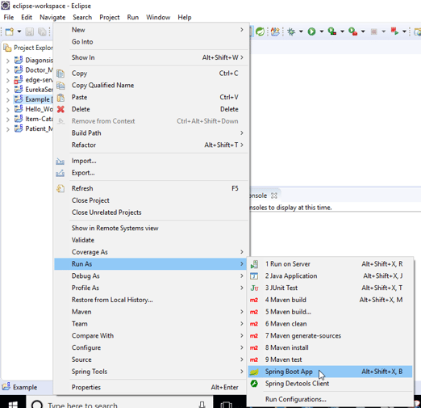

# SpringWebApp
## Overview
This project is for me to understand the fundamentals of **Spring MVC**, an essential web framework for Java developers who work on enterprise-level projects. I use controllers, models and views (hence MVC) to build an e-commerce website for athletes. I explore techinques for exception handling, themes, implementing asynchronous execution flows, and extending the Spring MVC application to serve REST requests. 


## Learning objectives 
  * Using Spring MVC for web projects 
  * Spring MVC controllers 
  * Implementing controller flows 
  * Validating data in models 
  * Localizing error messages 
  * Exception handling in Spring MVC 
  * Working with view resolvers 
  * Using interceptors 
  * Defining themes 
  * Spring MVC REST controllers

## To get the code:
Clone the repository:
```
$ git clone https://github.com/JuansonGrajales/JavaSpringWebApp.git
```
If this is your first time using Github, review https://help.github.com to learn the basics.

## To run the application:
I used Eclipse as the IDE to run my application. 
Right click on the project file and search for -> Run as -> SpringBoot App



Access the deployed web application at: http://localhost:8080/home/

## Note:
I used MySQL to authenticate the user's login and store product info. 
